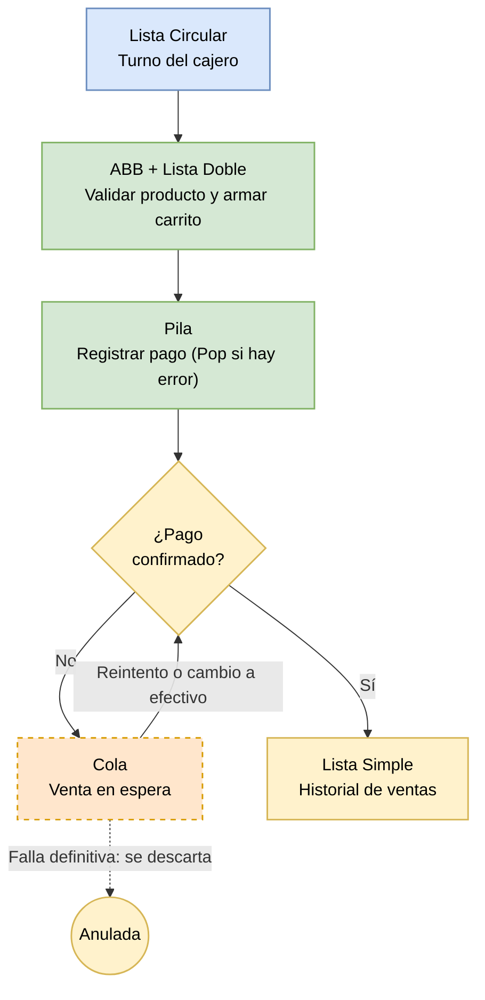
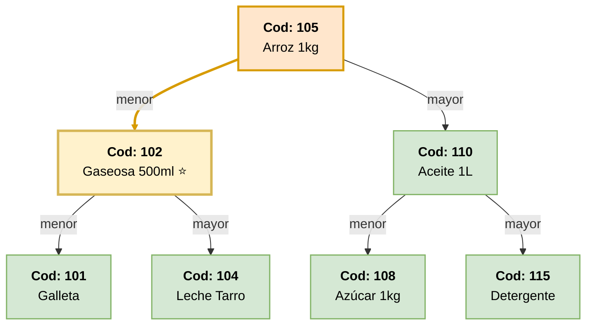
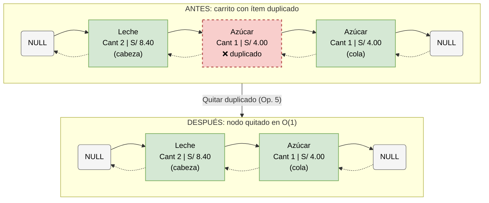
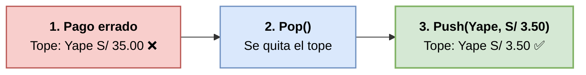
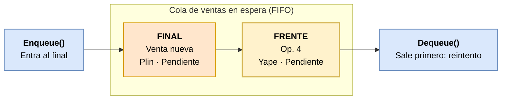
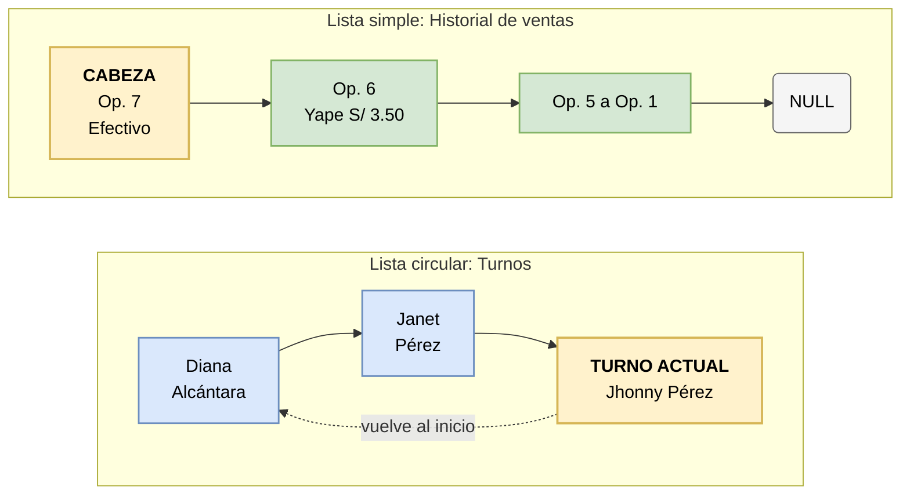

# 🛒 SierraMarket

**Curso de Estructuras de Datos**  
**Stack:** .NET 10 (C#) · Windows Forms  
**Estado:** En desarrollo 🚀

---

```mermaid
flowchart TD
    classDef entrada fill:#dae8fc,stroke:#6c8ebf,stroke-width:1.5px,color:#000
    classDef proceso fill:#d5e8d4,stroke:#82b366,stroke-width:1.5px,color:#000
    classDef salida fill:#fff2cc,stroke:#d6b656,stroke-width:1.5px,color:#000
    classDef espera fill:#ffe6cc,stroke:#d79b00,stroke-width:1.5px,stroke-dasharray: 5 5,color:#000

    T["Lista Circular<br/>Turno del cajero"]:::entrada
    V["ABB + Lista Doble<br/>Validar producto y armar carrito"]:::proceso
    P["Pila<br/>Registrar pago (Pop si hay error)"]:::proceso
    D{"¿Pago<br/>confirmado?"}:::salida
    C["Cola<br/>Venta en espera"]:::espera
    H["Lista Simple<br/>Historial de ventas"]:::salida
    X(("Anulada")):::salida

    T --> V --> P --> D
    D -- "Sí" --> H
    D -- "No" --> C
    C -- "Reintento o cambio a efectivo" --> D
    C -. "Falla definitiva: se descarta" .-> X
```

```mermaid
graph TD
    classDef camino fill:#ffe6cc,stroke:#d79b00,stroke-width:2.5px,color:#000
    classDef nodo fill:#d5e8d4,stroke:#82b366,stroke-width:1.5px,color:#000
    classDef encontrado fill:#fff2cc,stroke:#d6b656,stroke-width:3px,color:#000

    R["<b>Cod: 105</b><br/>Arroz 1kg"]:::camino
    I1["<b>Cod: 102</b><br/>Gaseosa 500ml ⭐"]:::encontrado
    D1["<b>Cod: 110</b><br/>Aceite 1L"]:::nodo
    I2["<b>Cod: 101</b><br/>Galleta"]:::nodo
    D2["<b>Cod: 104</b><br/>Leche Tarro"]:::nodo
    I3["<b>Cod: 108</b><br/>Azúcar 1kg"]:::nodo
    D3["<b>Cod: 115</b><br/>Detergente"]:::nodo

    R -- "menor" --> I1
    R -- "mayor" --> D1
    I1 -- "menor" --> I2
    I1 -- "mayor" --> D2
    D1 -- "menor" --> I3
    D1 -- "mayor" --> D3

    linkStyle 0 stroke:#d79b00,stroke-width:3px
```

```mermaid
flowchart TB
    classDef normal fill:#d5e8d4,stroke:#82b366,stroke-width:1.5px,color:#000
    classDef eliminado fill:#f8cecc,stroke:#b85450,stroke-width:2px,stroke-dasharray:5 5,color:#000
    classDef nulo fill:#f5f5f5,stroke:#666666,stroke-width:1px,color:#000

    subgraph ANTES["ANTES: carrito con ítem duplicado"]
        direction LR
        A0("NULL"):::nulo
        A1["Leche<br/>Cant 2 | S/ 8.40<br/>(cabeza)"]:::normal
        A2["Azúcar<br/>Cant 1 | S/ 4.00<br/>❌ duplicado"]:::eliminado
        A3["Azúcar<br/>Cant 1 | S/ 4.00<br/>(cola)"]:::normal
        A4("NULL"):::nulo

        A0 --> A1
        A1 --> A2
        A2 --> A3
        A3 --> A4

        A1 -.-> A0
        A2 -.-> A1
        A3 -.-> A2
        A4 -.-> A3
    end

    subgraph DESPUES["DESPUÉS: nodo quitado en O(1)"]
        direction LR
        B0("NULL"):::nulo
        B1["Leche<br/>Cant 2 | S/ 8.40<br/>(cabeza)"]:::normal
        B3["Azúcar<br/>Cant 1 | S/ 4.00<br/>(cola)"]:::normal
        B4("NULL"):::nulo

        B0 --> B1
        B1 --> B3
        B3 --> B4

        B1 -.-> B0
        B3 -.-> B1
        B4 -.-> B3
    end

    ANTES -- "Quitar duplicado (Op. 5)" --> DESPUES
```

```mermaid
flowchart LR
    classDef error fill:#f8cecc,stroke:#b85450,stroke-width:1.5px,color:#000
    classDef correcto fill:#d5e8d4,stroke:#82b366,stroke-width:2px,color:#000
    classDef accion fill:#dae8fc,stroke:#6c8ebf,stroke-width:1.5px,color:#000

    A["<b>1. Pago errado</b><br/>Tope: Yape S/ 35.00 ❌"]:::error
    B["<b>2. Pop()</b><br/>Se quita el tope"]:::accion
    C["<b>3. Push(Yape, S/ 3.50)</b><br/>Tope: Yape S/ 3.50 ✅"]:::correcto

    A --> B --> C
```

```mermaid
flowchart LR
    classDef frente fill:#fff2cc,stroke:#d6b656,stroke-width:2px,color:#000
    classDef cola fill:#ffe6cc,stroke:#d79b00,stroke-width:1.5px,color:#000
    classDef accion fill:#dae8fc,stroke:#6c8ebf,stroke-width:1.5px,color:#000

    ENQ["<b>Enqueue()</b><br/>Entra al final"]:::accion

    subgraph COLA ["Cola de ventas en espera (FIFO)"]
        direction LR
        S["<b>FINAL</b><br/>Venta nueva<br/>Plin · Pendiente"]:::cola
        F["<b>FRENTE</b><br/>Op. 4<br/>Yape · Pendiente"]:::frente
        S --> F
    end

    DEQ["<b>Dequeue()</b><br/>Sale primero: reintento"]:::accion

    ENQ --> S
    F --> DEQ
```

```mermaid
flowchart TB
    classDef hist fill:#d5e8d4,stroke:#82b366,stroke-width:1.5px,color:#000
    classDef turno fill:#dae8fc,stroke:#6c8ebf,stroke-width:1.5px,color:#000
    classDef activo fill:#fff2cc,stroke:#d6b656,stroke-width:2px,color:#000
    classDef nulo fill:#f5f5f5,stroke:#666666,stroke-width:1px,color:#000

    subgraph H ["Lista simple: Historial de ventas"]
        direction LR
        V7["<b>CABEZA</b><br/>Op. 7<br/>Efectivo"]:::activo --> V6["Op. 6<br/>Yape S/ 3.50"]:::hist
        V6 --> V5["Op. 5 a Op. 1"]:::hist
        V5 --> N("NULL"):::nulo
    end

    subgraph T ["Lista circular: Turnos"]
        direction LR
        T1["Diana<br/>Alcántara"]:::turno --> T2["Janet<br/>Pérez"]:::turno
        T2 --> T3["<b>TURNO ACTUAL</b><br/>Jhonny Pérez"]:::activo
        T3 -. "vuelve al inicio" .-> T1
    end

    H ~~~ T
```
